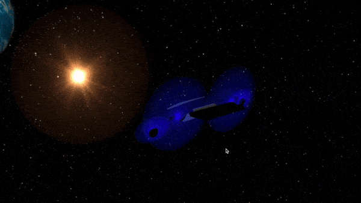

# Expressive 3D spaceship modeler 
It's a 3D spaceship modeler where you can easily create a spaceship of your dreams. 
This project has been done in **JavaScript** language using **ThreeJS** library. 

## Getting started
` git clone https://github.com/nikitakaraevv/3D-spaceship-modeler `

Go to the directory `3D-spaceship-modeler` and launch a python server:

` python3 -m http.server `

Then open the link in a web browser.

## Functionality

### Modeling process

There are a lot of different tools that can facilitate the process of spaceship modeling.
All actions that deal with objects in 3D:
- drag and drop  - *Ctrl + Select + Mouse Move*
- delete an object - *Delete / Backspace + Select*
- copy and insert the object - *C + Select*
- change of size - *Z + Select + Mouse Move*
- rotate - *R + Select + Mouse Move*

Tools for object creation:
- prism creation - *Shift + Draw on the board*
- extruded curve creation - *Alt + Draw on the board*

Start the animation - *Escape*

### Animation

## Authors
* [**Denis Chainikov**](https://github.com/Denisoidd)
* [**Nikita Karaev**](https://github.com/nikitakaraevv)
